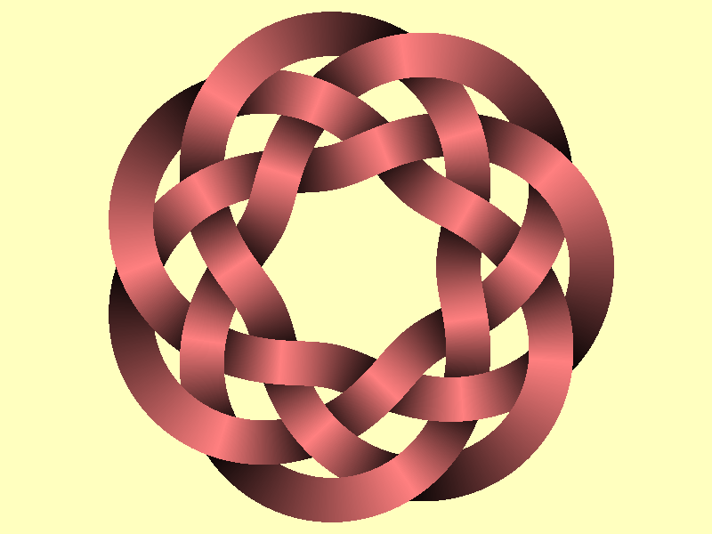
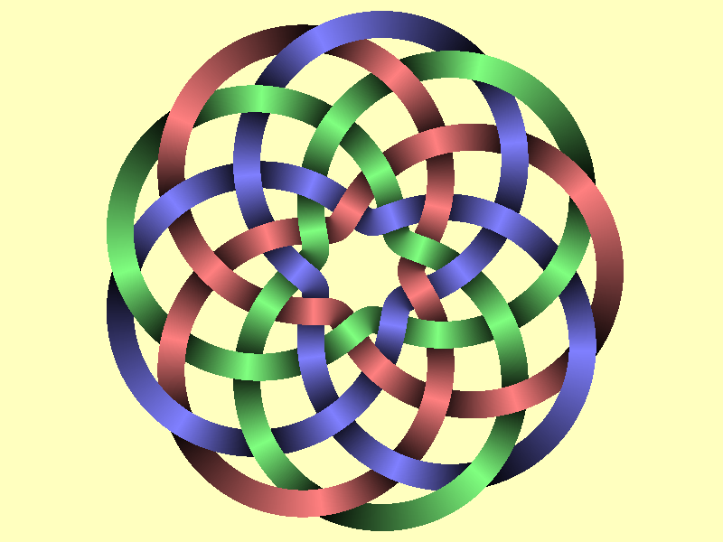

DrawTurksHead is a Python (2.7) library to draw `Turk's head knots <http://en.wikipedia.org/wiki/Turk%27s_head_knot>`_.
The core is in C++ and can also be used as a standalone C++ library.

It's licensed under the `MIT license <http://choosealicense.com/licenses/mit/>`__.
It's available on the `Python package index <http://pypi.python.org/pypi/DrawTurksHead>`__,
its `documentation is hosted by Python <http://pythonhosted.org/DrawTurksHead>`__
and its source code is on `GitHub <https://github.com/jacquev6/DrawTurksHead>`__.

Questions? Remarks? Bugs? Want to contribute? `Open an issue <https://github.com/jacquev6/DrawTurksHead/issues>`__!

.. image:: https://img.shields.io/travis/jacquev6/DrawTurksHead/master.svg
    :target: https://travis-ci.org/jacquev6/DrawTurksHead

.. image:: https://img.shields.io/coveralls/jacquev6/DrawTurksHead/master.svg
    :target: https://coveralls.io/r/jacquev6/DrawTurksHead

.. image:: https://img.shields.io/codeclimate/github/jacquev6/DrawTurksHead.svg
    :target: https://codeclimate.com/github/jacquev6/DrawTurksHead

.. image:: https://img.shields.io/scrutinizer/g/jacquev6/DrawTurksHead.svg
    :target: https://scrutinizer-ci.com/g/jacquev6/DrawTurksHead

.. image:: https://img.shields.io/pypi/dm/DrawTurksHead.svg
    :target: https://pypi.python.org/pypi/DrawTurksHead

.. image:: https://img.shields.io/pypi/l/DrawTurksHead.svg
    :target: https://pypi.python.org/pypi/DrawTurksHead

.. image:: https://img.shields.io/pypi/v/DrawTurksHead.svg
    :target: https://pypi.python.org/pypi/DrawTurksHead

.. image:: https://img.shields.io/github/issues/jacquev6/DrawTurksHead.svg
    :target: https://github.com/jacquev6/DrawTurksHead/issues

.. image:: https://badge.waffle.io/jacquev6/DrawTurksHead.png?label=ready&title=ready
    :target: https://waffle.io/jacquev6/DrawTurksHead

.. image:: https://img.shields.io/github/forks/jacquev6/DrawTurksHead.svg
    :target: https://github.com/jacquev6/DrawTurksHead/network

.. image:: https://img.shields.io/github/stars/jacquev6/DrawTurksHead.svg
    :target: https://github.com/jacquev6/DrawTurksHead/stargazers

Quick start
===========

Install from PyPI::

    $ pip install DrawTurksHead

Are you're good to go::

    $ python -m DrawTurksHead

(This will create a ``turkshead.png`` file in the current directory)

Examples
========

