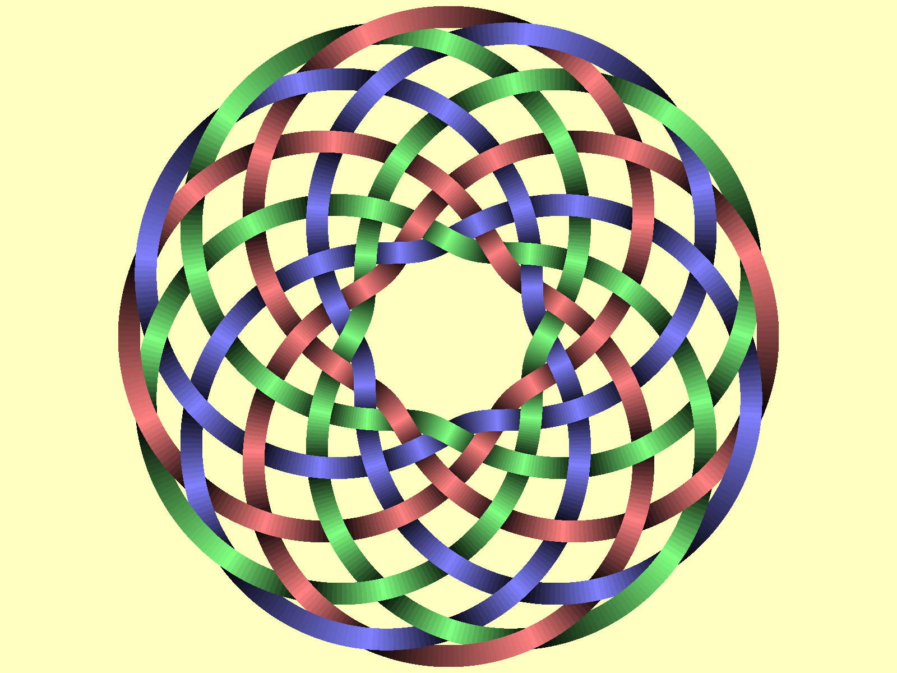

For a start we focus on the total time needed to produce this image:

with the following command::

    $ time python -m DrawTurksHead --width=1600 --height=1200 --leads=9 --bights=12 --radius-variation=450 --line-width=39 --output=profiling/reference.png

    real    0m5.511s
    user    0m5.484s
    sys     0m0.024s

We've modified the step for theta to reach a reasonable reference time (5s).
This step MUST NOT be modified between experience to be able to compare results.
This should be checked by comparing the visible color areas in the reference image and the produced image.

Profile Python code
===================

First phase: identify the "20%" of the code where "80%" of the time is spent.
Profiling immediately shows that constructing the TurksHead object is orders of magnitude faster than drawing it (25ms vs. 8s).

Cumtime in Coordinates.get is 5.662, cumtimes in fsin and fcos are 1.553 and 0.745 but cumtimes in math.sin and math.cos are 0.021 and 0.041.
Using fractions is not a good performance idea.
We could use integers for theta (dividing current thetas by step_theta).

This gave a tremendous speed improvement: 16 times faster!

Extract a C++ module
====================

Second phase: 300ms (of the 500ms total) are still spent in Coordinates.get_inner and .get_outer.
Let's try to rewrite that in C++.

Initially, timeit returns 0.332s.

After the plain translation of Coordinates to C++, timeit returns 0.133s.

The generated image has some differences with the previous one. Some strings have shifted by one pixel. Not a big deal.

So far, we have::

    $ time python -m DrawTurksHead --width=1600 --height=1200 --leads=9 --bights=12 --radius-variation=450 --line-width=39 --output=profiling/reference.png

    real    0m0.355s
    user    0m0.342s
    sys     0m0.012s

Improve quality
===============

Changing the step for theta, we can now generate images with no visible uniform regions on the string.
Let's generate a new reference for further optimization::

    $ time python -m DrawTurksHead --width=3200 --height=2400 --leads=18 --bights=24 --radius-variation=1000 --line-width=20 --output=profiling/reference.png

    real    0m1.883s
    user    0m1.868s
    sys     0m0.012s

And timeit returns 1.000s.

Port all drawing code to C++
============================

This makes interfaces neater and now timeit returns 0.374s.

What now?
=========

::

    $ time python -m DrawTurksHead --width=3200 --height=2400 --leads=18 --bights=24 --radius-variation=1000 --line-width=20 --output=profiling/reference.png

    real    0m1.201s
    user    0m1.184s
    sys     0m0.016s

Next things:

- compare ``__init__`` and ``draw`` again: the ratio may have changed with the improvments of draw.
- profile the C++ code

New baseline: draw takes 0.498s, init takes 0.185 and timeit returns 0.458s.

To improve draw, we need to profile the C++ code. Run through the Python interpreter. That will be fun.

But first let's see if there are some low-hanging fruits in init. And refactor this ugly Knot.__make_strings method.

Remove more fractions
=====================

Removing fractions in Python code altogether reduced init duration to 12ms.
Drawing still takes 500ms of C++ code. timeit returns 0.356s.

    $ time python -m DrawTurksHead --width=3200 --height=2400 --leads=18 --bights=24 --radius-variation=1000 --line-width=20 --output=profiling/reference.png

    real    0m1.144s
    user    0m1.130s
    sys     0m0.012s

Knot.__make_strings is still ugly, but we'll see to that later.

Let's profile the C++ code.

Profile C++ code
================

Total execution (including Python interpreter) is about 5,700,000,000 instructions (5.7G instructions).

Writing the image to the disk uses 3.5G instructions in a single call to libpng's png_write_image.
There's nothing we can do about that.
This explains the difference between timeit and ``time python -m DrawTurksHead``.

The remaining 700M instructions are spent starting the Python interpreter and executing our Python code.

Our C++ entry point (draw) is 'only' 1.5G instructions. This doesn't look a large optimization leverage :-(.
1G instructions are spent in 72,576 calls to Cairo::Context::fill. Could we call fill less often?
Only 89M instructions are spent inside _turkshead.so, so we have almost no leverage tweaking our own code.
The only thing we could do is call libraries in a more efficient way.
With a 50% improvement of draw (-750M instruction), the total improvement would be about 13%.

For reference, using 107 instead of 509 for theta_steps reduces draw to 223M (85% reduction) instructions and main to 3.8G instructions (33% reduction).
And produces visible uniform areas.
